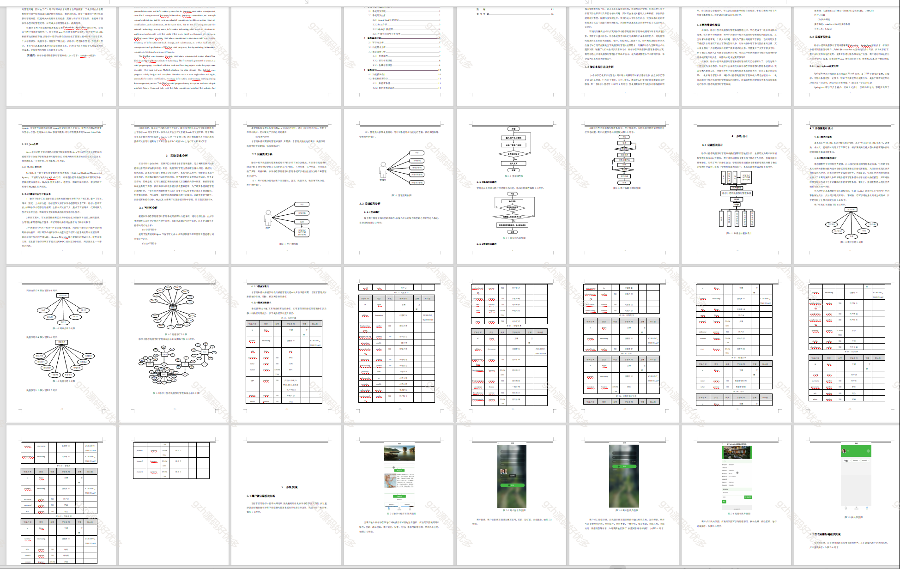

 
## 查看主页获取源码

### 一、作品包含

源码+数据库+设计文档万字+PPT+全套环境和工具资源+部署教程

### 二、项目技术

前端技术：Html、Css、Js、Vue3.0、Element-ui
数据库：MySQL
后端技术：Java、SpringBoot2.0、MyBatis

  

### 三、运行环境

开发工具：IDEA/eclipse  + 微信开发者工具 

数据库：MySQL5.7（最低要5.7版本）

数据库管理工具：Navicat10以上版本

环境配置软件： JDK1.8 + Maven3.6.3

前端Nodejs：14

浏览器：谷歌浏览器

### 四、项目介绍
项目编号：mpweixinA076

民宿预约管理系统采用weixin、SpringBoot架构技术，前端以小程序页面呈现给用户，结合后台java语言使页面更加完善，后台使用MySQL数据库进行数据存储。该微信小程序主要设计并完成了管理过程中的用户注册登录、个人信息修改、民宿信息、民宿预订等功能。该微信小程序操作简便，界面设计简洁，不但可以基本满足本行业的日常管理工作，同时又可以有效减少人员成本和时间成本，为民宿预约管理工作提供了方便。

### 五、运行截图

  
